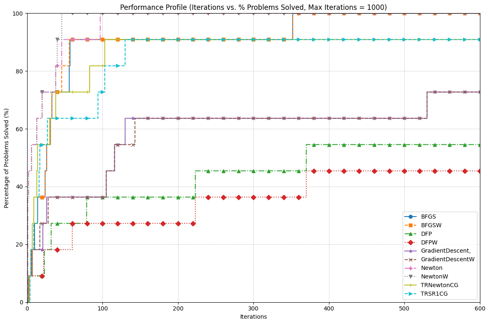

# OptiMaizer

OptiMaizer is a Python package for solving unconstrained and constrained optimization problems using a variety of classical and modern algorithms. It was developed for Math 562 / IOE 511: Continuous Optimization Methods at the University of Michigan.

---

## Installation

Clone the repository and install the required dependencies:

```bash
git clone <repository-url>
cd optiMaizer
pip install -r requirements.txt
```

---

## Usage

1. **Define the Problem**: Use the `Problem` class to specify the objective, gradient, and Hessian.
2. **Choose an Algorithm**: Select a method and configure its parameters.
3. **Set Options**: Define termination criteria and other settings.
4. **Run the Solver**: Call `optSolver(problem, method, options)` to solve the problem.

Example:

```python
import numpy as np
from optSolver import optSolver
from functions import rosen_func, rosen_grad, rosen_Hess

class Problem:
    def __init__(self, x0):
        self.x0 = x0
        self.compute_f = rosen_func
        self.compute_g = rosen_grad
        self.compute_H = rosen_Hess

problem = Problem(x0=np.array([1.2, 1.2]))

class Method:
    def __init__(self, name, step_type, alpha, tau, c1):
        self.name = name
        self.step_type = step_type
        self.alpha = alpha
        self.tau = tau
        self.c1 = c1

method = Method(name="GradientDescent", step_type="Backtracking", alpha=1, tau=0.5, c1=1e-4)

class Options:
    def __init__(self, term_tol=1e-6, max_iterations=100):
        self.term_tol = term_tol
        self.max_iterations = max_iterations

options = Options(term_tol=1e-6, max_iterations=100)

x, f, _ = optSolver(problem, method, options)
print("Optimal solution:", x)
print("Optimal function value:", f)
```

---

## Main Components

- **`optSolver.py`**: Main interface for running optimization algorithms.
- **`algorithms.py`**: Implementations of core algorithms (Gradient Descent, Newton, BFGS, L-BFGS, etc.).
- **`functions.py`**: Standard test functions (Rosenbrock, Quadratic, and others) with gradients and Hessians.
- **`project/`**: Scripts and results for benchmarking and experiments.

---

## Performance Evaluation & Project Work

During this project, I implemented and compared a suite of optimization algorithms on a variety of test problems, including the Rosenbrock and Quadratic functions. I developed a modular framework to facilitate fair benchmarking and reproducibility. Extensive experiments were conducted to evaluate convergence speed, robustness, and efficiency of each method.

The figure below shows a performance profile comparing the algorithms on a suite of problems:



All evaluative work, including experiment scripts and results, can be found in the `project/` directory. Homework folders (`hw2/`, `hw3/`, `hw4/`, `hw5/`) are not part of the main package and can be ignored.

---

**Developed by Hugh Van Deventer V and Itamar Pres**
